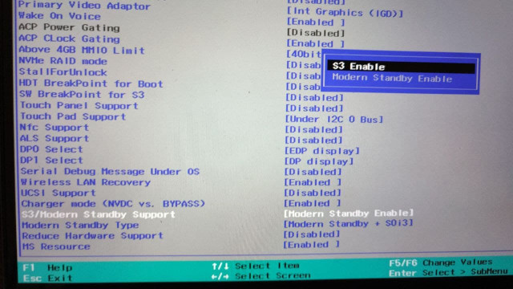

# Linux on Lenovo Yoga Slim 7 AMD

## About

This are various tweaks and fix to run Linux on Lenovo Yoga Slim 7. This note is validated on the following configuration
- Ubuntu 20.04.2 and 20.10
- Lenovo Yoga Slim 7 AMD 14ARE05 (Ryzen 7)

**Lenovo Yoga Slim 7 Pro is a different model**

## Summary

Legend:
- :heavy_check_mark: Works out of the box
- :hammer_and_wrench: Require tweaking
- :negative_squared_cross_mark: Not working
- :question: Unknown

| Feature                      | Status 20.04.1 and 20.04 | Status 20.04.2 and 20.10 | Description                                                                                                                                        |
| ---------------------------- | ------------------------ | ------------------------ | -------------------------------------------------------------------------------------------------------------------------------------------------- |
| Power (battery and charging) | :heavy_check_mark:       | :heavy_check_mark:       |                                                                                                                                                    |
| Storage                      | :heavy_check_mark:       | :heavy_check_mark:       | Disable bitlocker on windows to access windows partition from Linux                                                                                |
| Graphic                      | :hammer_and_wrench:      | :heavy_check_mark:       | Kernel update is required (see [below](#Graphic))                                                                                                  |
| USB                          | :heavy_check_mark:       | :heavy_check_mark:       |                                                                                                                                                    |
| Keyboard                     | :heavy_check_mark:       | :heavy_check_mark:       |                                                                                                                                                    |
| Speakers                     | :heavy_check_mark:       | :heavy_check_mark:       | Should work on older software but broken on some system (see [below](#Audio))                                                                      |
| Microphone                   | :heavy_check_mark:       | :heavy_check_mark:       | It seems there's a bug on kernel 5.7, please use other kernel version. On kernel 5.10.5+ microphone is broken again, see fix [below](#Microphone). |
| Audio jack                   | :heavy_check_mark:       | :heavy_check_mark:       |                                                                                                                                                    |
| Wifi and Bluetooth           | :heavy_check_mark:       | :heavy_check_mark:       | Connection through Wi-fi may be unavailable due to **Windows fast startup** (see [below](#Wi-Fi))                                                  |
| Webcam                       | :heavy_check_mark:       | :heavy_check_mark:       |                                                                                                                                                    |
| External display (HDMI)      | :hammer_and_wrench:      | :heavy_check_mark:       | Kernel update is required (see [below](#Graphic))                                                                                                  |
| Suspend                      | :hammer_and_wrench:      | :hammer_and_wrench:      | See detail [below](#Suspend)                                                                                                                       |

## Table of Content
- [Linux on Lenovo Yoga Slim 7 AMD](#linux-on-lenovo-yoga-slim-7-amd)
  - [About](#about)
  - [Summary](#summary)
  - [Table of Content](#table-of-content)
  - [System Output](#system-output)
  - [Fixes](#fixes)
    - [Graphic](#graphic)
    - [Suspend](#suspend)
      - [Background](#background)
      - [Possible Solutions](#possible-solutions)
      - [Modify DSDT](#modify-dsdt)
      - [Bios Unlock](#bios-unlock)
    - [Audio](#audio)
    - [Microphone](#microphone)
    - [Wi-Fi](#wi-fi)
  - [Extra: Battery Conservation Mode](#extra-battery-conservation-mode)
  - [Thanks](#thanks)

## System Output

`lsusb`, `lspci` and other output can be found on the [System Output](system-output.md) page.

## Fixes

**DISCLAIMER** I am not responsible for any damage and negative consequences to your system

### Graphic

By default Ubuntu 20.04.1 shipped with Linux 5.4, support for AMD 4000 graphics is still experimental on 5.4. To get the best result wait for Ubuntu 20.04.2 or upgrade manually to the latest stable kernel (5.8 by the time of publication). 

However, Ubuntu 20.04.2 provide Linux 5.8 which is compatible with AMD 4000 graphics. Please update your system `apt update && apt upgrade` 

If for some reason you can't update your kernel using the normal way, the following alternative can be used to upgrade the kernel:
- https://github.com/pimlie/ubuntu-mainline-kernel.sh
- https://github.com/bkw777/mainline

**Note: If you encounter `error: /vmlinux-<version number> has invalid signature.` on boot, you need to disable secure boot on the UEFI setting or follow https://gist.github.com/maxried/796d1f3101b3a03ca153fa09d3af8a11**

### Suspend

#### Background

In recent times Microsoft has introduced something called "[Modern Standby](https://docs.microsoft.com/en-us/windows-hardware/design/device-experiences/modern-standby)" which is essentially a new way to suspend with the advantage of allowing the system to do some task while suspending (e.g. fetching emails). In order to support this mode, the BIOS must not advertise support for the traditional suspend (S3) <sup>[Citation needed]</sup> 

```bash
$ dmesg | grep ACPI:\ \(
[    0.383096] ACPI: (supports S0 S4 S5)

```

By not advertising support for S3, the kernel will only support s2idle sleep mode which is also supported by Linux

```bash
$ cat /sys/power/mem_sleep 
[s2idle]
```

However there seems to be a problem with the amdgpu driver on resuming from suspend in this mode.

```
amdgpu 0000:03:00.0: [drm:amdgpu_ring_test_helper [amdgpu]] *ERROR* ring gfx test failed (-110)
[drm:amdgpu_device_ip_resume_phase2 [amdgpu]] *ERROR* resume of IP block <gfx_v9_0> failed -110
[drm:amdgpu_device_resume [amdgpu]] *ERROR* amdgpu_device_ip_resume failed (-110).
```

#### Possible Solutions

There are three solutions:
- Wait until the problem in amdgpu driver is fixed in newer kernel version
- Wait until Lenovo adds an option in the UEFI to advertise S3 support (similar to the options available in Thinkpad)
- Modify the system to advertise S3 support via modified DSDT (see [DSDT Modification](#modify-dsdt))
- Use the bios unlock method (see [Unlock BIOS](#bios-unlock))

Due to the everchanging nature of the Linux Kernel, some fixes may works on some kernel version only. Here are the support table for some of Ubuntu kernel version

| Kernel version | Official kernel?   | DSDT Method                   | Bios Unlock Method |
| -------------- | ------------------ | ----------------------------- | ------------------ |
| 5.8.0          | :heavy_check_mark: | :heavy_check_mark:            | :heavy_check_mark: |
| 5.11.0         | :heavy_check_mark: | :negative_squared_cross_mark: | :heavy_check_mark: |

Expanding this list is highly appreciated :)

#### Modify DSDT

**0. Important notes**

All of the following commands assume **root shell** (sudo -i)

```bash
sudo -i
```

**1. Get the required tools**

```bash
# Install some required dependencies
apt install acpica-tools
```

**2. Dump the ACPI files and decompile the DSDT table**

```bash
# Create new working directory
mkdir acpi
cd acpi

# Dump acpi table to binary files
acpidump -b

# Decompile dsdl.bat with all of the .dat as external symbol
iasl -e *.dat -d dsdt.dat
```

**3. Apply patch**

First, remove garbage from the source file:

```bash
sed -i '/^Firmware Error/d' dsdt.dsl
```

_(The exact content depends on the acpidump version.)_

Then copy dsdt.patch from this repo and patch `dsdt.dsl`:

```bash
patch <dsdt.patch
```

**4. Recompile the modified table**

```bash
# Recompile dsdt to new hex asml table (ignore warning)
iasl -ve -tc dsdt.dsl
```

**Note :**

It seems there are some model shipped with the first revision of the dsdt table. For those system the compilation will most likely fail. In order to fix that you can apply the `rev1.patch` provided in addition to the `dsdt.patch`. To make sure you have the first revision of the table check the decompiled file for the following line

```
*     OEM Revision     0x00000001 (1)
```

**5. Make override archive**
```bash
mkdir -p kernel/firmware/acpi
cp dsdt.aml kernel/firmware/acpi
find kernel | cpio -H newc --create > acpi_s3_override

# Copy to /boot
cp acpi_s3_override /boot/
```

**6. Set the default sleep type to S3 (deep)**

Open `/etc/default/grub` and add `mem_sleep_default=deep` to `GRUB_CMDLINE_LINUX_DEFAULT` then run `update-grub`

Example:
```
GRUB_CMDLINE_LINUX_DEFAULT="quiet splash mem_sleep_default=deep"
```

**7. Set grub to use the override**

**Note: There's a [problem](grub-fix.md) in older version of grub shipped with Ubuntu, make sure you upgrade your system (`apt update && apt upgrade`) before performing this step** 

Open `/etc/default/grub` and add `acpi_s3_override` to `GRUB_EARLY_INITRD_LINUX_CUSTOM` then run `update-grub`

Example:
```
GRUB_EARLY_INITRD_LINUX_CUSTOM="acpi_s3_override"
```

**8. Secure boot**

If you are using mainline kernel, skip this step.

If you are using the official kernel (for example in Ubuntu 20.10) be aware that you need to disable secure boot because of the default behaviour of Ubuntu kernel (relevant discussion [#10](https://github.com/jrandiny/yoga-slim7-ubuntu/issues/10)).

#### Bios Unlock

The following access advanced options of the BIOS and changing the wrong ones can result in a bricked device. Use at your own risk.

Lenovo has hidden some advanced options that are useful for overclocking, enabling s3 support, and other advanced functionality.

The advanced BIOS can be accessed in two ways:

* Using a special boot loader to access the exposed advanced BIOS options https://github.com/DavidS95/Smokeless_UMAF. After booting choose the first option (Device Manager) and follow the steps after unlocking the BIOS.
* Writing a special value on the I/O port, which can be done with the following tool https://github.com/esno/yoga-bios-unlock

After unlocking the BIOS
- go to `AMD PBS` on the top tab (on the bios)
- find `S3/Modern Standby Support`
- Press enter to change the value from `Modern Standby Enable` to `S3 Enable`



Tested on Bios version DMCN38WW
### Audio
If you see only a `Dummy Output` device in your audio-devices list, it is caused by a regression on ALSA https://bugs.launchpad.net/ubuntu/+source/alsa-lib/+bug/1901922

Fix is released, please update your system `apt update && apt upgrade`

If it's not (for example, on _Debian testing_), as a workaround, create a file
`/etc/modprobe.d/alsa-base.conf` containing:

```
options snd_hda_intel index=1,0
```

Then reboot.

### Microphone

This fix is for Linux 5.10.5+.

Add `snd_rn_pci_acp3x.dmic_acpi_check=1` to `GRUB_CMDLINE_LINUX_DEFAULT` in `/etc/default/grub`.

Then update grub config by running `sudo update-grub` (for debian-based distos) and reboot.

### Wi-Fi

The Wifi card (Intel AX200) is natively supported with kernel 5.1+. However, some systems with Windows 10 installed may not show Wi-Fi connection available. A known cause is the **Windows fast startup**.

The matter is fully discussed in the following community forums:
- https://community.intel.com/t5/Wireless/Unstable-AX200-connection-in-Ubuntu-20-04/m-p/1205573#M30527
- https://askubuntu.com/questions/1226036/intel-ax200-wi-fi-adapter-not-working

If you encounter this problem, please [disable it](https://www.windowscentral.com/how-disable-windows-10-fast-startup) and Wi-Fi should work without problems.

## Extra: Battery Conservation Mode

On Lenovo Vantage (the Windows 10 app) there's "Battery Conservation Mode" feature which limit battery charge to around 60% to increase battery lifespan. To enable this feature on Linux, you can use the following command.

1. Make sure `ideapad_laptop` module is loaded
```bash
# Should not be empty
lsmod | grep ideapad_laptop
```

2. Using root shell (`sudo -i`) run
```bash
# Turn on
echo 1 > /sys/bus/platform/drivers/ideapad_acpi/VPC2004:00/conservation_mode
# Turn off
echo 0 > /sys/bus/platform/drivers/ideapad_acpi/VPC2004:00/conservation_mode
```

Tested on kernel 5.8 and 5.11

Broken on kernel 5.12 (https://bugzilla.kernel.org/show_bug.cgi?id=213109)

Someone have also created a simple gnome extension to toggle this setting form the top bar
https://gitlab.com/annexhack/conservation-mode-lenovo/

## Thanks
- @SteveImmanuel for the information regarding microphone on kernel 5.7 and testing
- @nopmop for the audio workaround
- https://www.reddit.com/r/linuxhardware/comments/i28nm5/ideapad_14are05_s3_sleep_fix/ 
- https://wiki.archlinux.org/index.php/Lenovo_ThinkPad_X1_Yoga_(Gen_3)#Enabling_S3_(before_BIOS_version_1.33)
- https://bbs.archlinux.org/viewtopic.php?id=238678
- @esno and @FlyGoat for the bios unlock
- https://forum.manjaro.org/t/amd-renoir-cpu-microphone-not-working-on-kernel-5-10-5/48463/12
- https://wiki.archlinux.org/index.php/Laptop/Lenovo#Battery_Conservation_Mode_on_IdeaPad_laptops
